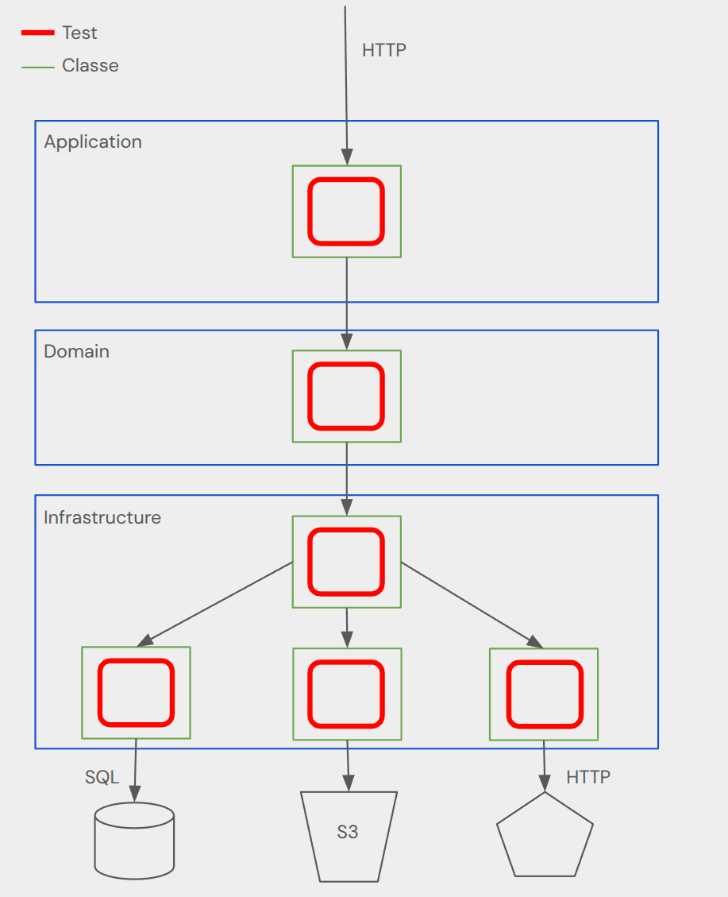
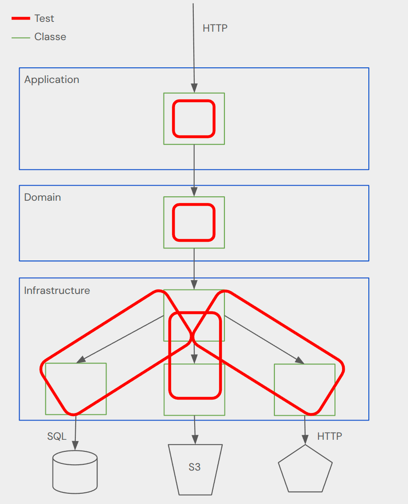
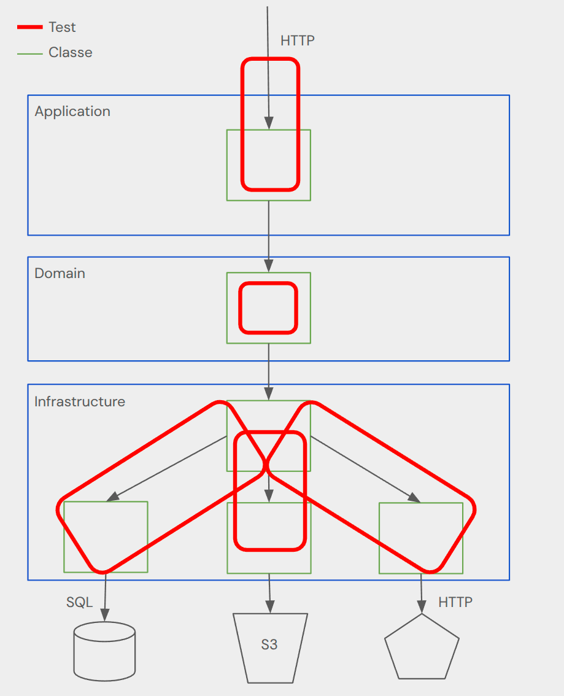
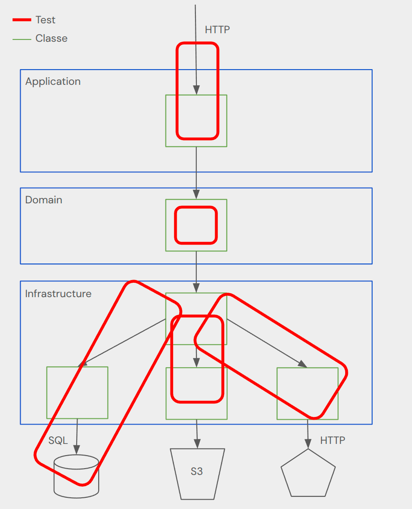
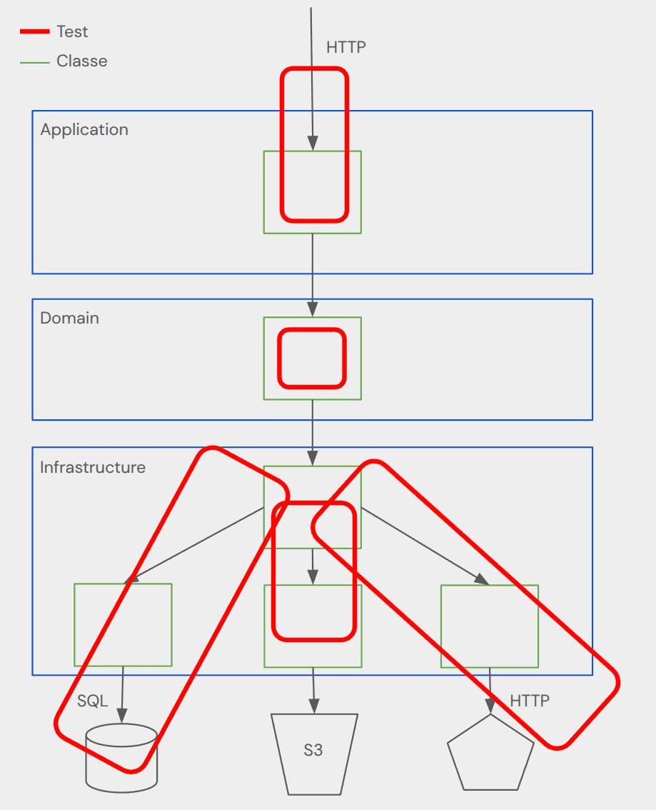
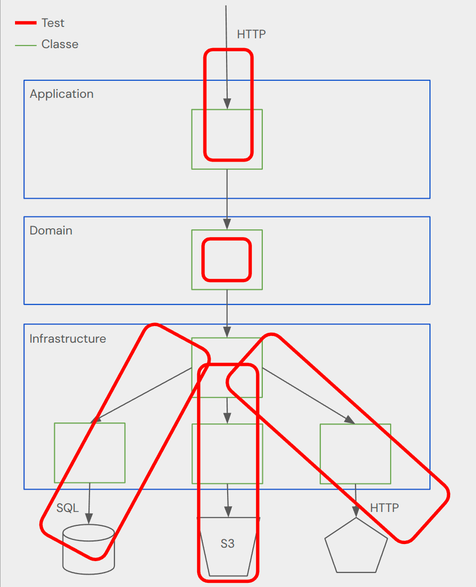
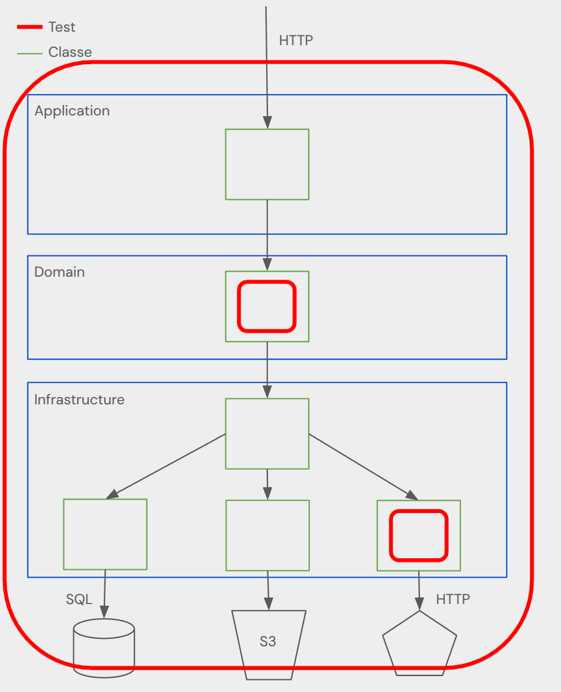

# Arrêtez de miser sur vos Tests Unitaires !


## Description fonctionnelle de l'application

L'application est un service de publication de conférences, voici les étapes :
* Récupérer les données de la conférence depuis la Base de données
* Sauvegarde des données de la conférence dans un bucket S3 (back up)
* Appel à l'API de Sessionize pour publier la conférence

## Besoins techniques

* Docker installé (Pour ceux qui utilisent Podman, voici la manip' [ici](https://www.baeldung.com/java-podman-configure-testcontainers))
* Java 25 (Si vous avez [mise](https://mise.jdx.dev/) : mise use -g java@temurin-25)
* Java 21 peut suffire, il suffit de modifier `java.version` dans le `pom.xml` à 21

## V1 - Uniquement des TU



## V2 - Des TU un peu plus long


* Copier package de test `fr.fellows.tp_test.v1` dans un nouveau package v2
* Améliorer les tests dans `ConferenceAdapterTest`, le but est de descendre le mock d'un niveau, il faut donc mocker :
  * `RestTemplate`
  * `SessionizeConfigurationProperties`
  * `ConferenceRepository`
  * `S3ConfigurationProperties`
  * `S3Template`
* Pour cela, nous allons devoir laisser tomber les TU purs Java pour intégrer du contexte Spring
* En annotation de classe utiliser :
```java
@ExtendWith({SpringExtension.class, MockitoExtension.class})
@ContextConfiguration(classes = {ConferenceAdapter.class, SessionizeProvider.class, ConferenceInfraMapperImpl.class, S3Provider.class})
```
* `@Mock` sera remplacé par `@MockitoBean` et `@InjectMocks` par `@Autowired`
* Les tests de S3ProviderTest et SessionizeProviderTest peuvent être supprimés

## V3 - Testons les requêtes entrantes

* Créer un nouveau package de test v3 dans `fr.fellows.tp_test`
* Copier package de test `fr.fellows.tp_test.v2_correction` dans un nouveau package v3
* Ici c'est `ConferenceControllerTest` qui va évoluer pour simuler une requête http et l'on va devoir rajouter aussi du Spring
* En annotation de class, utiliser :
```java
@SpringBootTest 
@ActiveProfiles("test")
@AutoConfigureMockMvc
@ExtendWith(MockitoExtension.class)
```
* Il faut ensuite injecter `MockMvc`
* `@Mock` sera remplacé par `@MockitoBean`
* L'envoi de la requête se fait via la méthode `perform` : `MvcResult result = mvc.perform(post("/api/v1/conferences/123/publish")).andReturn();`
* Dans le `MvcResult`, il est possible de récupérer la réponse pour asserter le status et le body 
* Pour asserter le json de la réponse, utiliser la méthode static `JSONAssert.assertEquals()`
* L'idée est aussi de supprimer la class `ControllerExceptionHandlerTest` et de rajouter les tests des cas d'erreur

## v4 - Discutons avec la BDD

* Copier package de test `fr.fellows.tp_test.v3_correction` dans un nouveau package v4
* En annotation de class de `ConferenceAdapterTest`, utiliser :
```java
@SpringBootTest
@ActiveProfiles("test")
@Testcontainers
@ExtendWith(MockitoExtension.class)
```
* Il faut maintenant démarrer un postgres dans un conteneur, grâce à testcontainer :
```java
  @Container
  @ServiceConnection
  static PostgreSQLContainer pg = new PostgreSQLContainer("postgres:latest");
```
* `@ServiceConnection` va automatiquement configurer Spring avec les informations de connexion à la base de données
* Pour insérer des jeux de données en base, j'aime bien passer par un repository, il faut donc injecter `ConferenceRepository` et l'utiliser dans le test pour faire un insert (à noter que le MockitoBean sur le repository doit disparaitre)

## v5 - Rajoutons les requêtes sortantes

* Copier package de test `fr.fellows.tp_test.v4_correction` dans un nouveau package v5
* En annotation de class de `ConferenceAdapterTest`, rajouter :
```java
@EnableWireMock(@ConfigureWireMock(
        baseUrlProperties = {"sessionize.base-url"}
))
```
* Injecter également wiremock dans le test. Il sera automatiquement démarré et son url sera automatiquement mise dans la property `sessionize.base-url`
```java
  @InjectWireMock
  WireMockServer wireMock;
```
* Retirer les mock sur `RestTemplate` et `SessionizeConfigurationProperties`
* Dans le test, déclarer le mock du endPoint dans wiremock `wireMock.stubFor(post("/api/talks")`, il est intéressant de vérifier le header le login, le body et de retourner un code http 201 :
```java
wireMock.stubFor(post("/api/talks")
  .withBasicAuth(...)
  .withRequestBody(equalToJson("""
      {
          ...
      }
      """))
  .willReturn(...));
```

## v6 - Un peu d’infrastructure AWS

* Copier package de test `fr.fellows.tp_test.v5_correction` dans un nouveau package v6
* LocalStack va servir à démarrer un conteneur docker pour simuler un bucket S3
```java
    @ServiceConnection
    static LocalStackContainer localstack = new LocalStackContainer(DockerImageName.parse("localstack/localstack:3.4"))
            .withServices("s3");
```
* `@ServiceConnection` va automatiquement configurer Spring avec les informations de connexion au bucket
* Retirer les mock sur `S3Template` et `S3ConfigurationProperties`
* Injecter `S3Template` pour initialiser le bucket voulu et pour vérifier le contenu du bucket en fin de test 

## v7 - 
* Copier package de test `fr.fellows.tp_test.v6_correction` dans un nouveau package v7
* Garder les tests de la correction de la v6 et améliorer l'expérience de rédaction d'un test en créant des méthodes dans des abstractions

Etat final :

